# Chat Morse Entrenador

Entrenador de código Morse y chat que se escribe solo con la **llave Morse**
(punto y raya), pensado para aprender el alfabeto practicando y, después,
conversar con otras personas sin necesidad de teclado.

Funciona en el navegador, en móvil y en ordenador, en español, inglés y ruso.

**▶ Probar ahora: https://niki2510.github.io/chat-morse-entrenador/**

En esa versión publicada funciona toda la práctica y el chat entre pestañas
del mismo navegador. Para chatear entre varios dispositivos hace falta el
servidor en la red local (ver más abajo).

## Capturas

### Chat

| Entrada con apodo | Chat público |
|---|---|
| 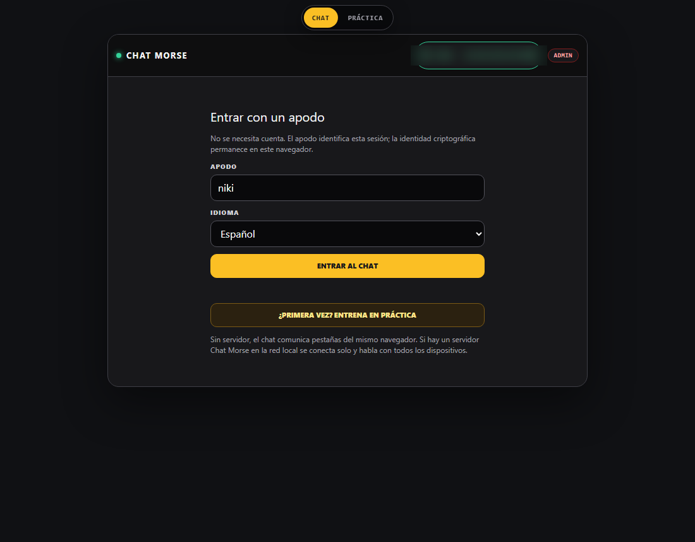 | 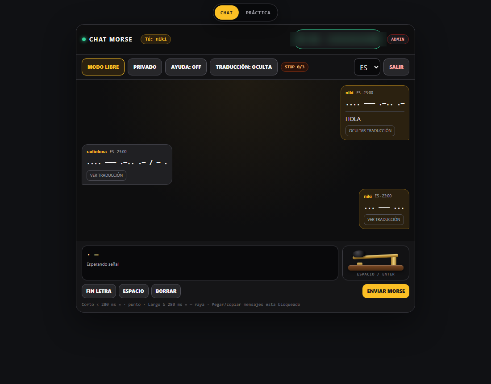 |

| Copiar una frase con la llave | Sala privada cifrada |
|---|---|
| 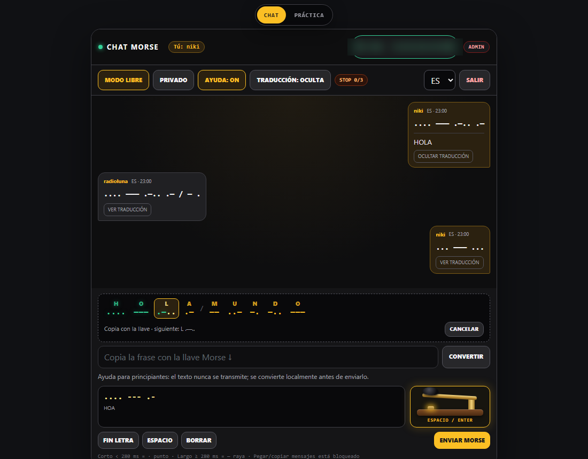 | 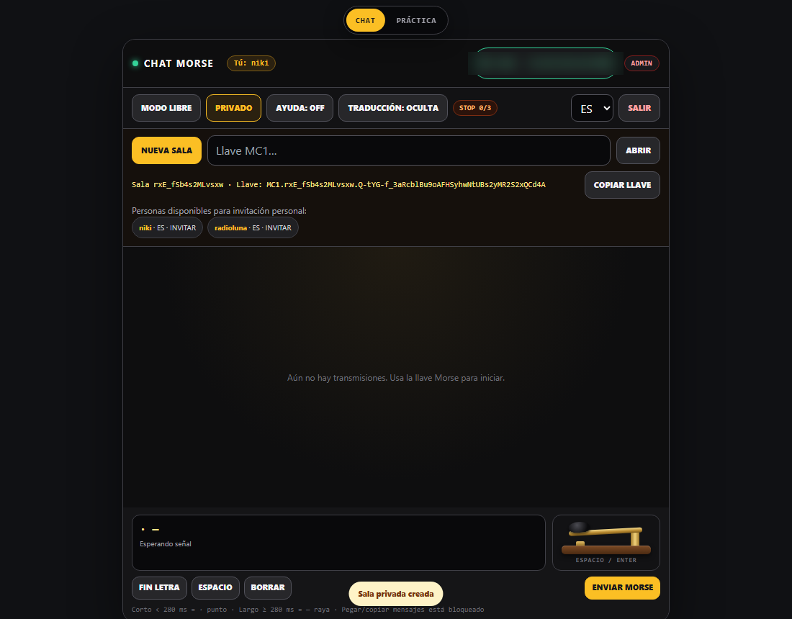 |

| Invitación a la sala | Mensajes cifrados visibles |
|---|---|
| 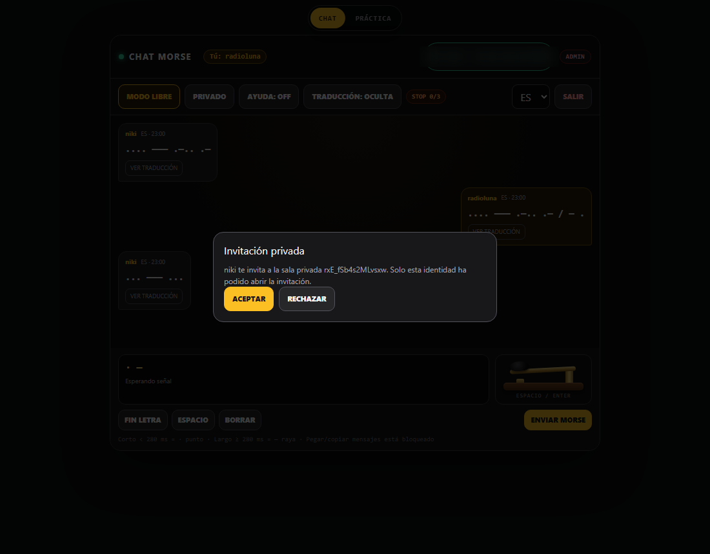 | 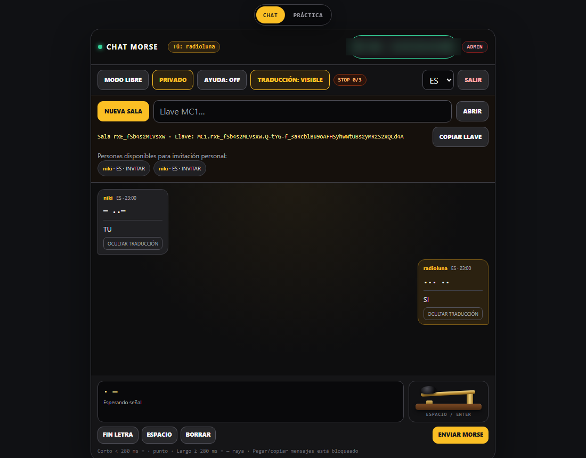 |

### Práctica

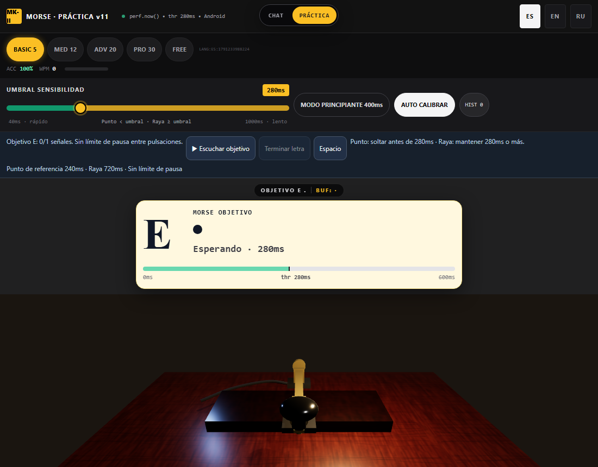

| Inglés | Ruso |
|---|---|
| 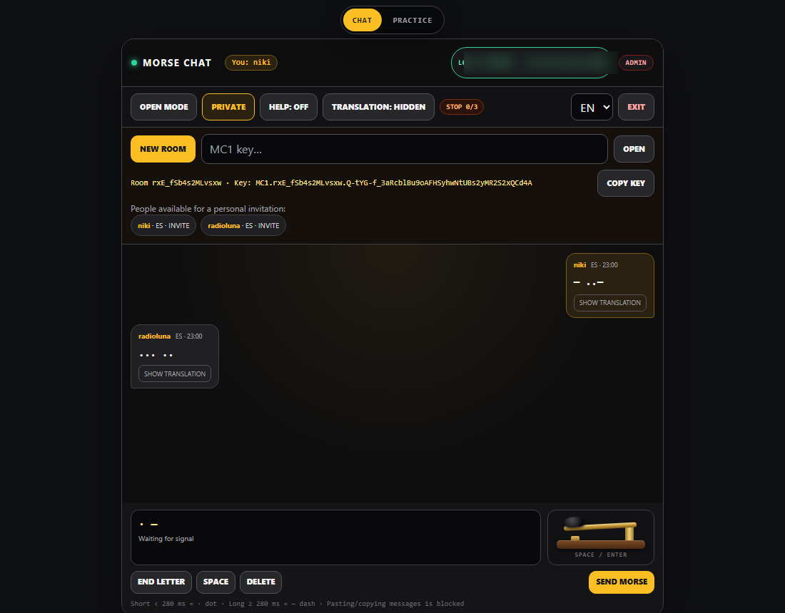 | 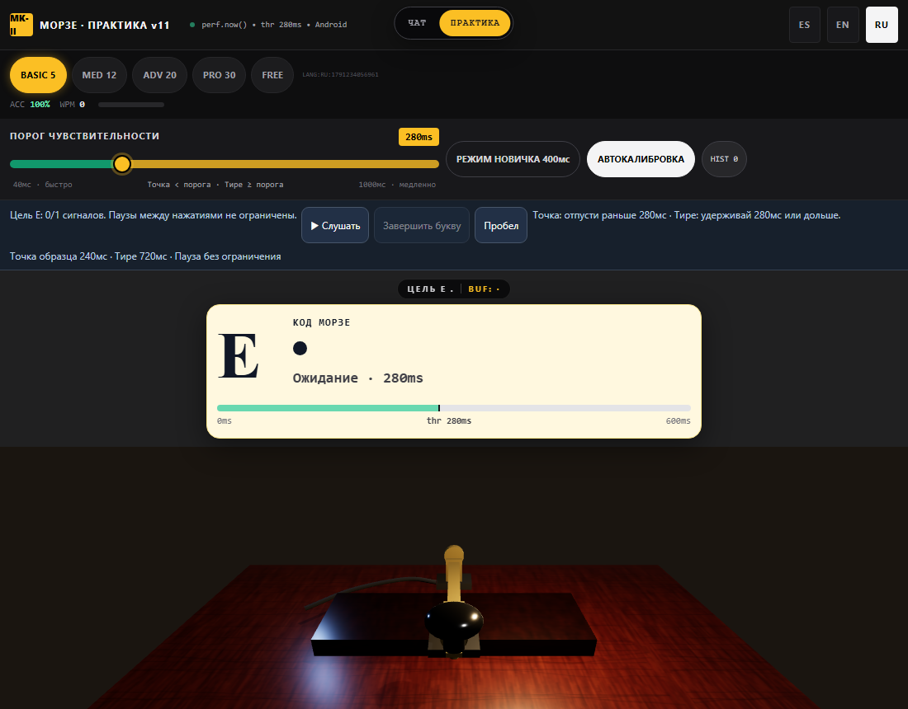 |

### Móvil

| Chat | Práctica |
|---|---|
| 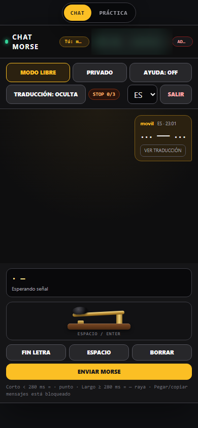 | 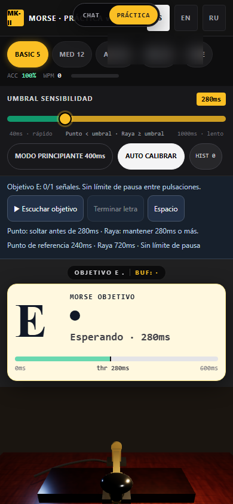 |

### Administración

| Acceso | Usuarios e IPs |
|---|---|
| 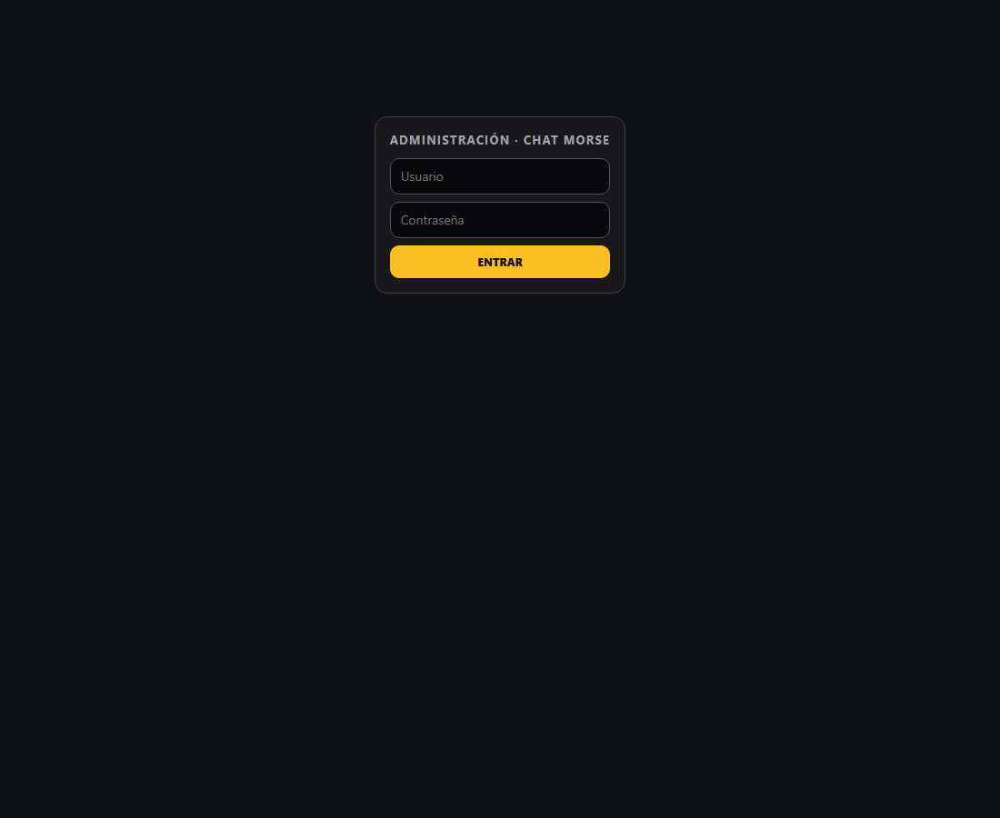 | 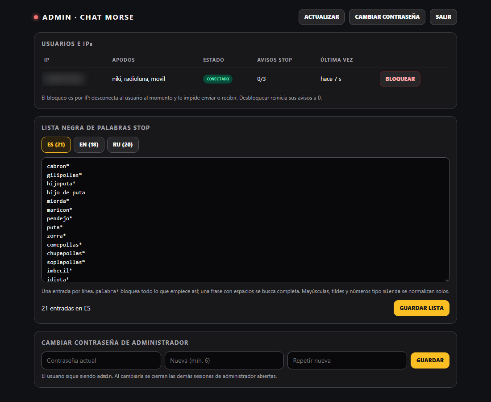 |

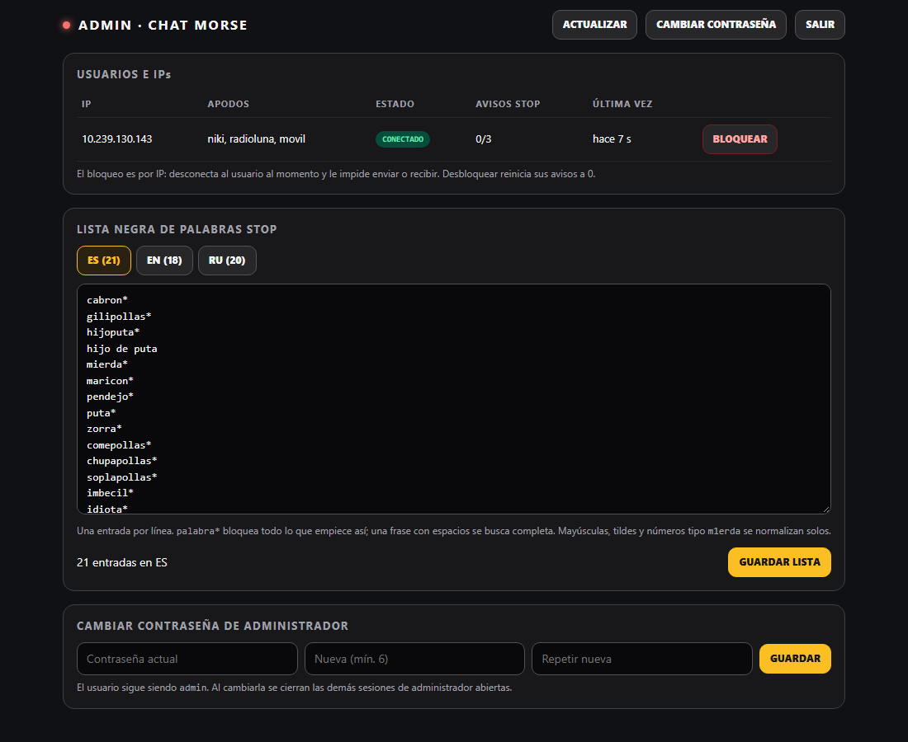

## Qué incluye

- **Llave Morse** con ratón, dedo o teclado (Espacio / Enter). Suena un tono
  mientras la mantienes pulsada. Punto si la pulsación es corta (< 280 ms),
  raya si es larga.
- **Práctica**: objetivos por letras, umbral de sensibilidad ajustable,
  modo principiante, auto calibración e histograma.
- **Chat público** en modo libre, con traducción oculta o visible.
- **Ayuda para principiantes**: escribes texto normal, se convierte a Morse y
  tienes que copiarlo con la llave, letra a letra, antes de poder enviarlo.
  Pegar y copiar mensajes está bloqueado.
- **Salas privadas cifradas de extremo a extremo** con invitación personal.
- **Idiomas**: español, inglés y ruso, también en la práctica.
- **Red local**: sin servidor, el chat funciona entre pestañas del mismo
  navegador. Con el servidor Flask en la red, se conecta solo a todos los
  dispositivos.
- **Moderación STOP**: lista negra de palabras por idioma. Tres avisos
  bloquean la IP.
- **Panel de administración**: bloquear o desbloquear usuarios, editar la
  lista STOP y cambiar la contraseña.

## Arranque rápido

### Solo en el navegador

Abre `Morse-Android.html` (junto a `morse-chat.js`, `morse-chat.css`,
`morse-moderation.js` y `nacl-fast.min.js`). Funciona sin instalar nada.

### Con servidor en la red local (Windows)

Doble clic en **`iniciar-chat-morse.bat`**. Comprueba Python, instala Flask
si falta, arranca el servidor y abre el navegador con la IP real del equipo.
Los demás dispositivos de la red entran con esa misma dirección
(`http://IP:5050`).

Manualmente:

```
pip install -r requirements.txt
python server.py --open
```

Detalles del servidor, descubrimiento automático y API: [SERVIDOR-LAN.md](SERVIDOR-LAN.md).

### Administración

`http://IP:5050/admin`. Usuario `admin`. La contraseña inicial es la que
viene en `server.py`; cámbiala desde el panel o con
`python server.py --set-admin-password`.

## Estructura

| Archivo | Función |
|---|---|
| `Morse-Android.html` | Práctica de Morse (la página principal) |
| `morse-chat.js` / `morse-chat.css` | Chat, cifrado, idiomas, red local |
| `morse-moderation.js` | Lista negra STOP y normalización de texto |
| `nacl-fast.min.js` | TweetNaCl, cifrado que funciona también por `http://` en la red |
| `server.py` | Servidor Flask: reenvío de mensajes, moderación, administración |
| `admin.html` | Panel de administración |
| `iniciar-chat-morse.bat` | Arranque del servidor en Windows |
| `SERVIDOR-LAN.md` | Documentación del servidor |
| `MODERATION-SERVER.md` | Contrato de moderación del servidor |

## Seguridad y privacidad

- Los mensajes de **salas privadas** se cifran en el navegador
  (TweetNaCl: secretbox con clave de sala, y cajas para las invitaciones).
  El servidor los reenvía pero no puede leerlos.
- Los mensajes **públicos** no están cifrados: se ven en claro en la red local.
- El bloqueo de moderación es **por IP**. Si varias personas comparten IP, se
  bloquean juntas.
- El servidor usa HTTP sin cifrar dentro de la red. Si la red no es de
  confianza, conviene ponerle HTTPS.
- Cambia la contraseña de administrador antes de usar el servidor con otras
  personas.

## Requisitos

- Navegador moderno (Chrome, Edge, Firefox, Safari).
- Para el servidor: Python 3.10 o superior y Flask (`requirements.txt`).
